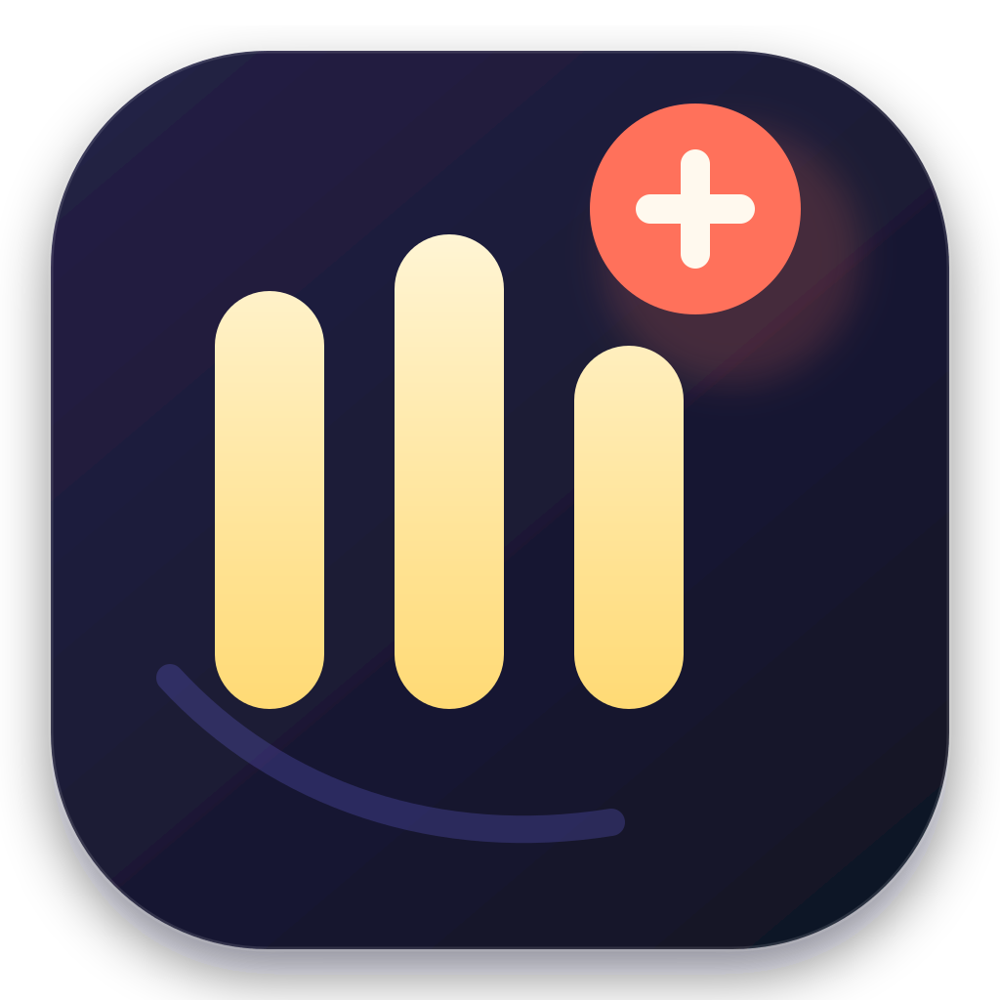
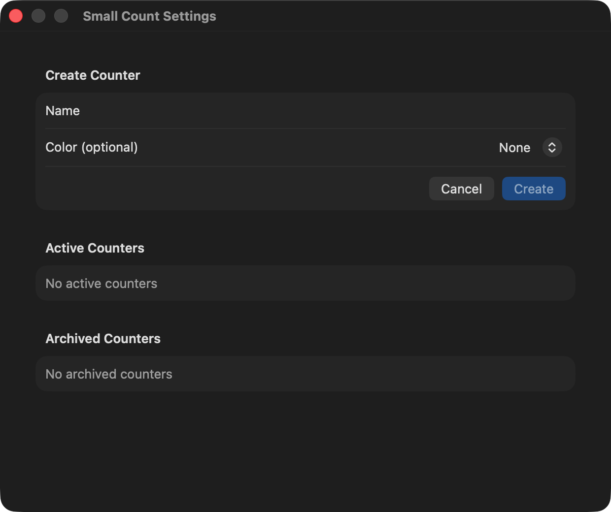

<p align="center">
  
</p>

<h1 align="center">Small Count</h1>

<p align="center">
  <strong>A private tally, one click away.</strong><br>
  Create focused counters, record moments from the menu bar, and keep every count on your Mac.
</p>

<p align="center">
  <a href="https://github.com/nodaysidle/small-count/releases/latest"></a>
  
  
  
  
  
</p>

<p align="center">
  <a href="#why-small-count">Why</a> ·
  <a href="#features">Features</a> ·
  <a href="#privacy">Privacy</a> ·
  <a href="#install">Install</a> ·
  <a href="#usage">Usage</a> ·
  <a href="#architecture">Architecture</a> ·
  <a href="#development">Development</a>
</p>

---

<p align="center">
  
</p>

## Why Small Count?

Most tracking tools turn a simple tally into a system. Small Count keeps the useful part: a name, a click, and a trustworthy history.

It lives in the macOS menu bar, opens instantly, and stores everything locally. No account. No dashboard to maintain. No cloud quietly holding your habits.

| Small by design | What it means |
| --- | --- |
| **One-click recording** | Select a counter in the menu-bar popover to add exactly one event. |
| **Local-day totals** | Today is calculated using the captured macOS calendar and time zone, including DST boundaries. |
| **Reversible organization** | Archive and restore counters without deleting their event history. |
| **Portable history** | Export one counter and its full ordered history as deterministic UTF-8 Markdown. |
| **Failure-safe state** | Persistence, export cancellation, and recoverable errors preserve the last valid state. |
| **Quietly native** | SwiftUI, AppKit, Observation, and SwiftData—no web shell or external packages. |

## Features

| Area | Capability |
| --- | --- |
| Counters | Create and edit named counters with an optional color |
| Recording | Add one timestamped event directly from the menu bar |
| Today | See exact totals for the current local calendar day |
| Archive | Hide inactive counters without deleting history |
| Restore | Return archived counters to the active list |
| Export | Save canonical Markdown through the standard macOS save panel |
| Navigation | Arrow-key menu navigation, `⌘,` Settings, and `⌘Q` Quit |
| Accessibility | VoiceOver labels, semantic colors, reduced-motion behavior, keyboard focus |
| Recovery | Retry surfaced failures while retaining the last valid snapshot |

## Privacy

Small Count is intentionally local-only.

- Counters and events live in an app-owned SwiftData store on your Mac.
- No networking, analytics, telemetry, accounts, AI, notifications, or cloud sync.
- No global keyboard shortcuts and no background capture.
- Export writes only to the destination you select.
- Cancelling an export writes nothing.
- Archive and restore are reversible state transitions; the app has no destructive delete feature.

## Install

### Download the release

1. Download [`Small-Count-v0.1.0-macos.dmg`](https://github.com/nodaysidle/small-count/releases/download/v0.1.0/Small-Count-v0.1.0-macos.dmg).
2. Open the DMG.
3. Drag **Small Count.app** to **Applications**.
4. Launch Small Count and select its count icon in the menu bar.

> [!NOTE]
> The current release is ad-hoc signed and is not Apple-notarized. On first launch, macOS may require **right-click → Open**, or approval in **System Settings → Privacy & Security**.

### Verify the download

Download the matching `.sha256` file, then run:

| Asset | SHA-256 |
| --- | --- |
| `Small-Count-v0.1.0-macos.dmg` | `be9e50d7b0191623226f5f1f63ff765696d2a82bf908e399c7cdb5a464eaae6e` |

```bash
shasum -a 256 -c Small-Count-v0.1.0-macos.dmg.sha256
```

## Usage

1. Open the menu-bar popover and choose **Settings…**.
2. Enter a counter name, optionally select a color, and choose **Create**.
3. Close Settings and select the counter in the menu-bar popover.
4. Each selection records one event and updates today's total.
5. Use Settings to edit, archive, restore, or export a counter.

The complete operator guide is in [USERGUIDE.md](USERGUIDE.md).

## Keyboard shortcuts

| Action | Shortcut |
| --- | --- |
| Move through counters | <kbd>↑</kbd> / <kbd>↓</kbd> |
| Open Settings | <kbd>⌘</kbd><kbd>,</kbd> |
| Quit Small Count | <kbd>⌘</kbd><kbd>Q</kbd> |

## Export format

Exports are deterministic Markdown: stable ordering, UTF-8 bytes, and LF line endings. This makes counter history readable by people and predictable for version control or downstream tools.

```markdown
# Small Count Export

## Counter
- Name: Reading
- Archived: false

## Events
- 2026-08-27T20:23:00Z
```

## Architecture

```text
Small Count
├── Sources/App/                 # lifecycle, MenuBarExtra, AppKit fallback, settings
├── Sources/Domain/              # Counter, Event, snapshot, drafts and changes
├── Sources/MenuBarFeatures/     # one typed operation per product feature
├── Sources/Platform/            # local time, SwiftData, save-panel adapters
├── Tests/                       # Swift Testing suites and contract coverage
├── Resources/                   # editable SVG, native ICNS, product screenshot
└── Scripts/                     # app and DMG packaging
```

State mutations flow through typed feature operations into one `SmallCountSnapshot`. The store saves transactionally and restores the previous snapshot if persistence fails. Platform effects stay behind narrow protocols, which keeps domain behavior deterministic and testable.

The app retains SwiftUI's `MenuBarExtra` and includes a scoped AppKit status-item fallback for macOS systems where Control Center suppresses SwiftUI menu extras. The fallback hosts the same SwiftUI menu content; explicit Quit remains distinct from automatic visibility-driven termination.

## Development

**Requirements:** macOS 15+, Xcode Command Line Tools, Swift 6.

```bash
git clone https://github.com/nodaysidle/small-count.git
cd small-count

swift test
swift build -c release
Scripts/package_app.sh
Scripts/build_dmg.sh
```

Verify the packaged app:

```bash
codesign --verify --deep --strict --verbose=2 "build/Small Count.app"
hdiutil verify "dist/Small-Count-v0.1.0-macos.dmg"
```

## Test coverage

The Swift Testing suite covers:

- every typed product feature from create through export and quit
- reversible archive/restore invariants
- DST-safe local-day boundaries
- SwiftData round-trip and ordered schema migration
- exact Markdown export bytes
- keyboard, appearance, VoiceOver, cancellation, and recovery contracts
- package identity, icon resources, lifecycle fallback, and DMG release contracts

## Documentation

- [USERGUIDE.md](USERGUIDE.md) — installation and user workflows
- [PRD.md](PRD.md) — product requirements
- [ARD.md](ARD.md) — architecture decisions
- [TRD.md](TRD.md) — technical contracts
- [TASKS.md](TASKS.md) — implementation sequence
- [AGENTS.md](AGENTS.md) — execution guardrails
- [CHANGELOG.md](CHANGELOG.md) — release history

## Status

| Field | Value |
| --- | --- |
| Version | 0.1.0 |
| Platform | macOS 15+ |
| Architecture | Apple Silicon (`arm64`) |
| Stack | Swift 6 · SwiftUI · AppKit · SwiftData · Observation |
| Storage | Local only |
| Distribution | Ad-hoc signed DMG; not notarized |

## Contributing

This repository is not currently accepting external contributions.

## Copyright

Copyright © 2026 NODAYSIDLE. All rights reserved.
